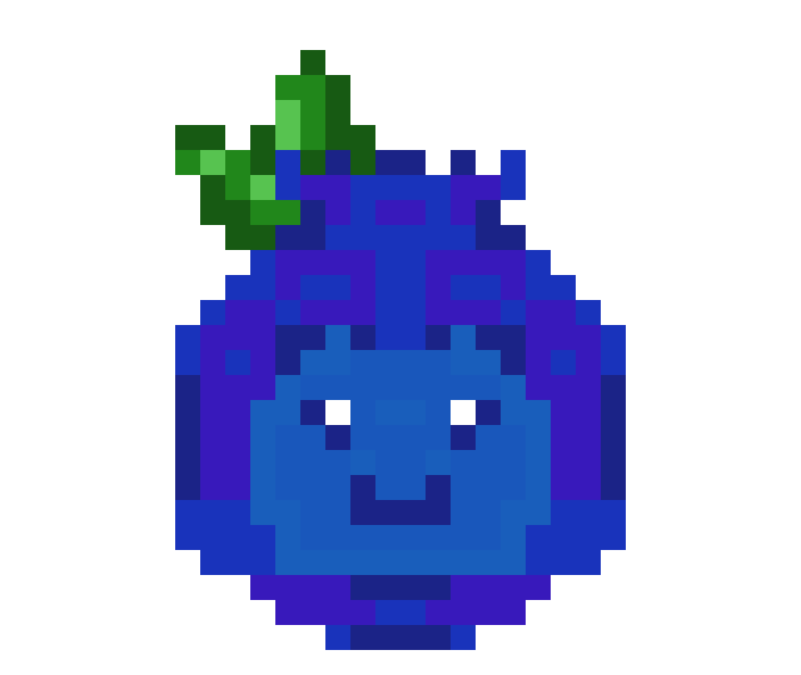

## Blueberry Game

### Top Down Boss Arena Game


Inspired by [Pineapple Game](https://tacticalairhorse.itch.io/nerubar-palace), a browser game on itch.io designed to help teach people the mechanics of World of Warcraft bosses in a safe and fun environment.

### Gameplay Mechanics

Blueberry Game is designed to be a quick to understand game to people already familiar with the basics of video games and especially World of Warcraft. The bosses are directly inspired by bosses from the lastest raids, with the first finished being Plexus Sentinel from Manaforge Omega.

In the game the player will have access to four main ability to fight against the boss and their mechanics that require specific problem solving skills to overcome.

The player has access to a dash that gives them momentary frames of immunity from incoming damage, essential for specific mechanics. A heal that will reliably keep them alive through the whole boss so long as it is managed effenciently. A melee swing which will be the player's core way of dishing out damage. Lastly a ranged fireball that can be used to sneak in a quick burst of damage on a cooldown if the player is forced to move away from the boss.

### Architecture

Blueberry game is built on React for the front end website, Phaser for the game's engine and mechanics, and Express for the back-end.

The game's logic is handled solely in the front end within a container within React while the backend server is used to store data about a user should they choose to make an account. It's main purpose is to save your best completed time for each boss!

### How to Play!



- Use <kbd>W</kbd> <kbd>A</kbd> <kbd>S</kbd> <kbd>D</kbd> to move.
- <kbd>SPACE</kbd> to dash!
- <kbd>Q</kbd> to heal!
- <kbd>F</kbd> to fire your ranged attack!
- And Left Click to swing your melee attack!

- Make sure you keep an eye out for various boss attacks as well.
  - Damage areas that will hurt you if you stand in them.
  - Zones that must be stood in to remain safe.
  - Mechanics that must use the dash to avoid or perish.

## How to Run and Develop Blueberry Game Locally

The first and most important thing to do is to make sure you have [Node.js with NPM](https://nodejs.org/en/download/) installed so that you can install Phaser and other necessary components for the game to run.

With those installed, all you need to do is install the game's dependencies with a simple command.

```
npm install
```

Full list of dependencies if you need to manually install:

@eslint, eslint, eslint-plugin-react-hooks, eslint-plugin-react-refresh, globals --Used for checking errors and enforcing style rules during development

@vitejs/plugin-react-swc, vite --Frontend build tool

bcrypt --Used to securely hash passwords

dotenv --Lets you use .env files to store variables

express --Web server framework for backend API

jsonwebtoken, jwt-decode --Used to create and verity JWTs

pg --PostgreSQL client for Node.js

phaser --This is the game engine!

react, react-dom, react-router-dom --Frontend library and navigation

Then to start a local server to run the game for you it's a simple as:

```
npm run dev
```

The game will then be accessible at `http://localhost:5173/`.

### Accessing API Functionality

If you want to access the API during gameplay (register, login, and save highscores!) you'll need the backend server as well!

Make sure you set up your .env file

In a separate CLI use:

```
node server.js
```

To see any changes made to the backend you'll need to reboot the server.

## Credits

Thanks to:

- [beamedeighth](https://beamedeighth.itch.io/simplekeys-animated-pixel-keyboard-keys?download) for the keyboard icons.
- [bdragon1727](https://bdragon1727.itch.io) for various effect sprites.
- [clockworkraven](https://clockworkraven.itch.io) for ability icons.
- [towball](https://towball.itch.io) for music.
